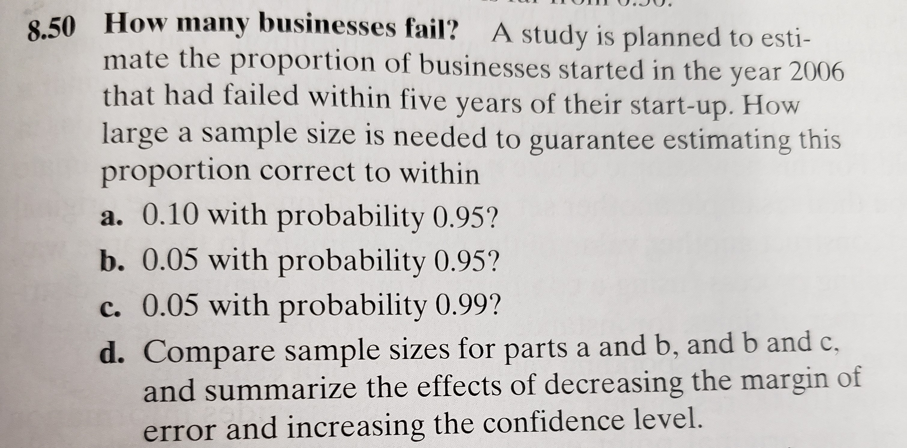
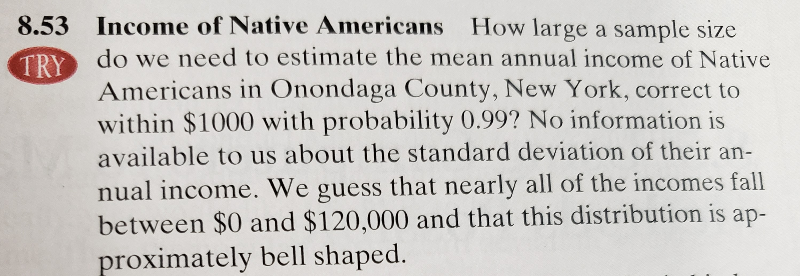
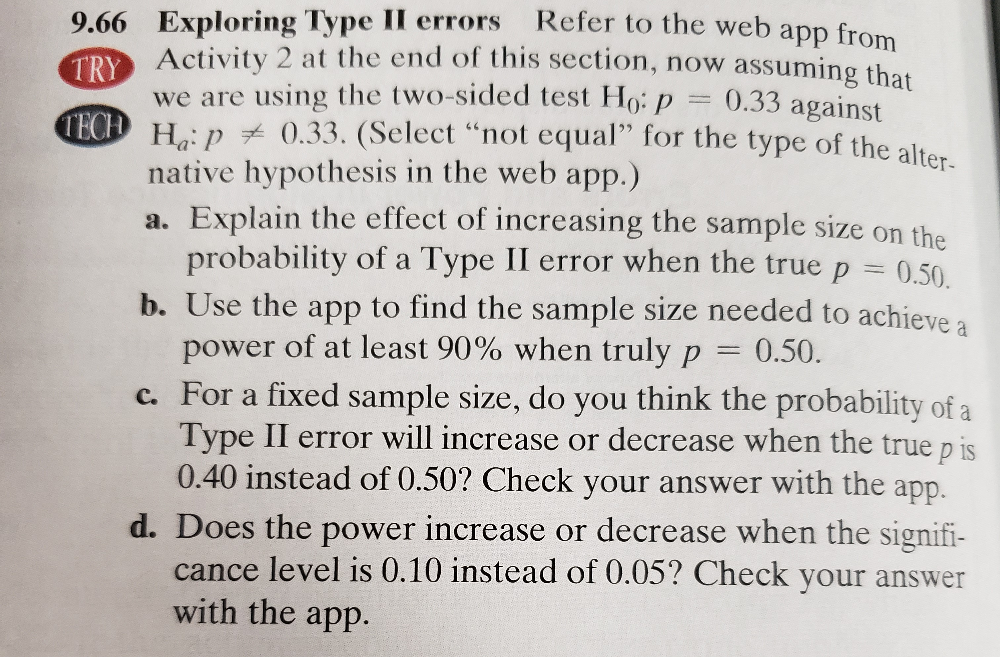

```{r setup, include=FALSE}
knitr::opts_chunk$set(echo = TRUE)
```


## Submit the solution in the form of R Markdown report, knitted into either of the available formats (HTML, pdf or Word). Provide all relevant code and output. Goal of this homework is to have you  1) familiarized with sample size calculation procedures; 2) concepts of power & Type II error for significance tests; 3) practice your R coding.

## Whenever asked to do mathematical derivations, which would include heavy usage of formulas and algebraic notation, you may either:
  1. **Type it up in LaTeX mode (check the .Rmd source file for some examples), like this**
  $$z_{1-\alpha/2} \sqrt{\frac{\hat{p}(1-\hat{p})}{n}} = \dots \implies \dots$$
  2. **Write the solutions by hand, take a picture, insert it into this R markdown document (DON'T supply it separately), like this**
  

<!-- {#id .class width=500 height=500px} -->

**Check the $.Rmd$ source file for examples, and also, see \url{https://stackoverflow.com/questions/25166624/insert-picture-table-in-r-markdown} for reference on how to insert images and manipulate image size in R markdown.**

\newpage


# Problem #1

  1. Write a $prop.sample.size()$ function that will output the sample size needed for a one-sample proportion test to achieve 

      * a desired margin of error (argument \#1)
      * for a given confidence level (argument \#2), 
    
  in the "worst-case scenario" (as was explained in class). What is meant by the "worst-case scenario"?
  
```{r}
prop.sample.size <- function(m, cl){
  alpha <- 1-cl
  p.hat <- 0.5 # worst-case scenario
  qnorm(1-alpha/2)^2*(p.hat * (1-p.hat))/m^2
}
```
The "worst-case scenario" occurs when $\hat p=0.5$. This guarantees that the numerator segment $\hat p(1-\hat p)$ is at the maximum possible value ($0.25$), thus guaranteeing the maximum sample size for the target margin of error and confidence level.
  
  2. Use your $prop.sample.size()$ from part $1$ to do **exercise $8.50$** from the Agresti book.
  
  {#id .class width=500 height=500px} 
  
  **a)** `r prop.sample.size(.1,.95)` => 97\
  **b)** `r prop.sample.size(.05,.95)` => 385\
  **c)** `r prop.sample.size(.05,.99)` => 664\
  **d)** Margin of error and sample size have a negative association (margin of error decreases the sample size increases), as exemplified by a and b. Confidence level and sample size have a positive association (confidence level increases the sample size increases), as exemplified by b and c.
  
  3. Write a $mean.sample.size()$ function that will output the sample size needed for a one-sample mean test to achieve
  
      * a desired margin of error (argument \#1)
      * for a given confidence level (argument \#2), 
      * for a given standard deviation (argument \#3).
      
```{r}
mean.sample.size <- function(m, cl, sd){
  alpha <- 1-cl
  qnorm(1-alpha/2)^2*sd^2/m^2
}
```

  
  Proceed to use that function in order to do **exercise $8.53$** from the Agresti book.
  
  {#id .class width=500 height=500px}
  
  Because we know the distribution is aproximately bell shaped, we can use the empirical rule to estimate the standard deviation since we know most of the data falls within 3 standard deviations of the data.
  $\frac{120000-0}{6\sigma}=>\sigma=20000$
  Using the `mean.sample.size()` function as defined above, the estimated sample size needed is `r mean.sample.size(1000,.99,20000)` => 2654
  
  
  4. For a **two-sample proportion test**, presuming equal sample sizes ($n_1 = n_2 \equiv n$), proceed to derive the mathematical formula for the sample sizes needed to achieve
  
      * a desired margin of error (argument \#1)
      * for a given confidence level (argument \#2). 
      
  Do it in similar fashion to how it was derived in class for **one-sample proportion** test. How is the obtained formula different from the case of **one-sample proportion** test?

$se=\sqrt{\frac{\hat p_1 (1-\hat p_1)}{n_1}+\frac{\hat p_2 (1-\hat p_2)}{n_2}}$
$m=z_{1-\frac{\alpha}{2}}(se)$

$m^2=(z_{1-\frac{\alpha}{2}})^2(\frac{\hat p_1 (1-\hat p_1)}{n}+\frac{\hat p_2 (1-\hat p_2)}{n})$\
$m^2=(z_{1-\frac{\alpha}{2}})^2\times\frac{1}{n}\times(\hat p_1 (1-\hat p_1)+\hat p_2 (1-\hat p_2)))$\
$n\times m^2=(z_{1-\frac{\alpha}{2}})^2(\hat p_1 (1-\hat p_1)+\hat p_2 (1-\hat p_2))$\
$n=\frac{(z_{1-\frac{\alpha}{2}})^2(\hat p_1 (1-\hat p_1)+\hat p_2 (1-\hat p_2))}{m^2}$\
Worst-case:\
$n=\frac{(z_{1-\frac{\alpha}{2}})^2(0.5 (1-0.5)+0.5 (1-0.5))}{m^2}$\
$n=\frac{(z_{1-\frac{\alpha}{2}})^2(0.5\times0.5+0.5\times0.5)}{m^2}$\
$n=\frac{(z_{1-\frac{\alpha}{2}})^2\times0.5}{m^2}$\
$n=\frac{(z_{1-\frac{\alpha}{2}})^2}{2m^2}$

# Problem #2

  1. Use the \url{https://istats.shinyapps.io/power/} app to do **exercise $9.66$** from Agresti book.
  
  {#id .class width=500 height=500px}
  
  **a)** Increasing the sample size narrows the curve, thus decreasing the probability of a Type II error when the true $p=0.50$.\
  **b)** A sample size of at least 83 people is needed to achieve a power of at least 90% when truly $p=0.50$.\
  **c)** The probability of a Type II error will increase when the true $p$ is $0.40$ instead of $0.50$ because the distance between the curve centers decreases, increasing the overlap and thus also the Type II error.\
  **d)** Power increases when the significance level is $0.10$ instead of $0.05$ because the widening tails of Type I error cause Type II error to decrease, thus increasing power.
  
  2. Presume you've developed a skin cancer treatment and you were granted permission to try it out on patients. You would like to test if its accuracy differs from the golden standard method which has $28\%$ cure rate. In particular, you'd want the ability to correctly detect a difference of $10\%$ (practically significant effect).
  
  **Hint**: To answer parts $(c),(d),(e)$, you can use the in-class $R$ code from $Slides\_1.R$, playing around with the parameters.
  
  Proceed to
  
  **a. Formulate the hypotheses for the one-sample proportion test.**\
  $p:$success of the new treatment curing skin cancer\
  $H_0:p=0.28$ $H_a:p=0.38$
  
  **b. Interpret the statement: "At a $0.05$ significance level, the significance test will have $0.77$ power when detecting a difference of $10\%$."**\
  We are 95% confident that the probability of rejecting $H_0:p=0.28 given that p is actually 0.38 would be equal to 0.77, on average.
  
  **c. Presume we witness your treatment's results for $100$ patients. Obtain the power of one-sample proportion test at $\alpha=0.05$ significance level when detecting a difference of $10\%$.**
```{r}
n <- 100
p.0 <- .28
p.a <- .38
alpha <- 0.05
# The quantiles for rejection region (defined fully under H_0)
rej.q <- qnorm(1-alpha/2, mean=p.0, sd=sqrt(p.0*(1-p.0)/n))
# Calculating P(p^hat in Rejection Region | H_a is true) =
#             P(p^hat in (-rej.q, rej.q) | H_a is true)
type.2 <- pnorm(rej.q, mean = p.a, sd = sqrt(p.a*(1-p.a)/n)) - 
  pnorm(-rej.q, mean = p.a, sd = sqrt(p.a*(1-p.a)/n))
1-type.2
```
  
  **d. Presume we witness your treatment's results for $100$ patients. Obtain the $\alpha$ significance level needed for your test to have the power of $0.85$ when detecting a difference of $10\%$.**
```{r}
alpha <- 0.27
# The quantiles for rejection region (defined fully under H_0)
rej.q <- qnorm(1-alpha/2, mean=p.0, sd=sqrt(p.0*(1-p.0)/n))
# Calculating P(p^hat in Rejection Region | H_a is true) =
#             P(p^hat in (-rej.q, rej.q) | H_a is true)
type.2 <- pnorm(rej.q, mean = p.a, sd = sqrt(p.a*(1-p.a)/n)) - 
  pnorm(-rej.q, mean = p.a, sd = sqrt(p.a*(1-p.a)/n))
1-type.2
```
  
  **e. What $\#$ of patients is needed for your test to have the power of $0.85$ when detecting a difference of $10\%$ (at $\alpha=0.05$ significance level)?**
```{r}
beta <- 0.15
alpha <- 0.05
(qnorm(1-alpha/2)*sqrt(p.0*(1-p.0)) - qnorm(beta)*sqrt(p.a*(1-p.a)))^2/(p.a-p.0)^2
```

  **f. In this case, do you think it is more important for your test to have lower significance level or higher power? Explain.**\
  A lower significance level equates to higher Type II error. A higher power equates to lower Type II error. The consequences of a Type II error, claiming that the new treatment is no different from the old one when in fact it is actually 10 percentage points higher, is missing out on something hugely impactful. Therefore, higher power is more important in this case.
  
  **g. Provided that you don't have the resources to recruit more than $n=100$ patients, what can you do in order to increase the power of your test for detecting $10\%$ difference (_Hint_: See part $(d)$).**\
  Because the sample size and $p_a$ is fixed, the only option for increasing the power is to increase the significance level.


# Problem #3 (bonus 3 pts)

Derive the "actual formula" for calculating sample size that would yield:

   * a specific Type II error ($beta$)
   
for a proportion hypothesis test with a specific

   * null value $p.0$,
   * alternative value $p.a$,
   * $\alpha$ significance level.
  
**Note**: This formula is provided in $Slides\_1.R$ source code, but in this problem you need to **derive** this formula from scratch.

$n=\frac{(z_{1-\frac{\alpha}{2}}\times\sqrt{p_o(1-p_o)}-z_\beta\times\sqrt{p_a(1-p_a)})^2}{(p_a-p_o)^2}$

Using the two-sample proportion test as a basis...
$n=\frac{(z_{1-\frac{\alpha}{2}}+z_\beta)^2\times(\hat p_0 (1-\hat p_0)+\hat p_a (1-\hat p_a))}{m^2}$
$n=\frac{(z_{1-\frac{\alpha}{2}}+z_\beta)^2\times(\hat p_0 (1-\hat p_0)+\hat p_a (1-\hat p_a))}{(\hat p_0-\hat p_a)^2}$
