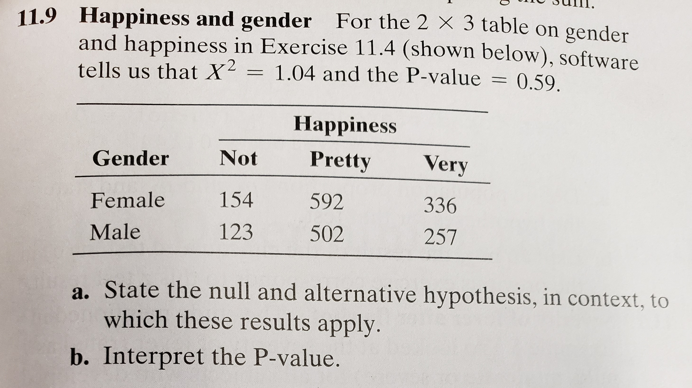
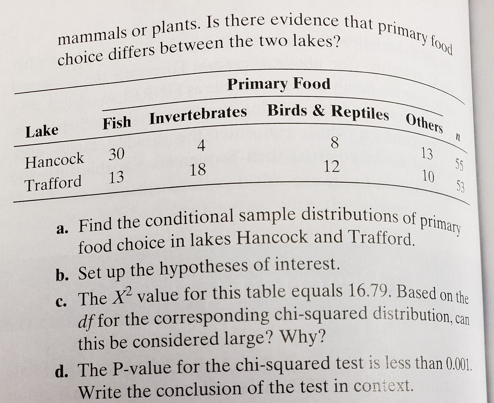
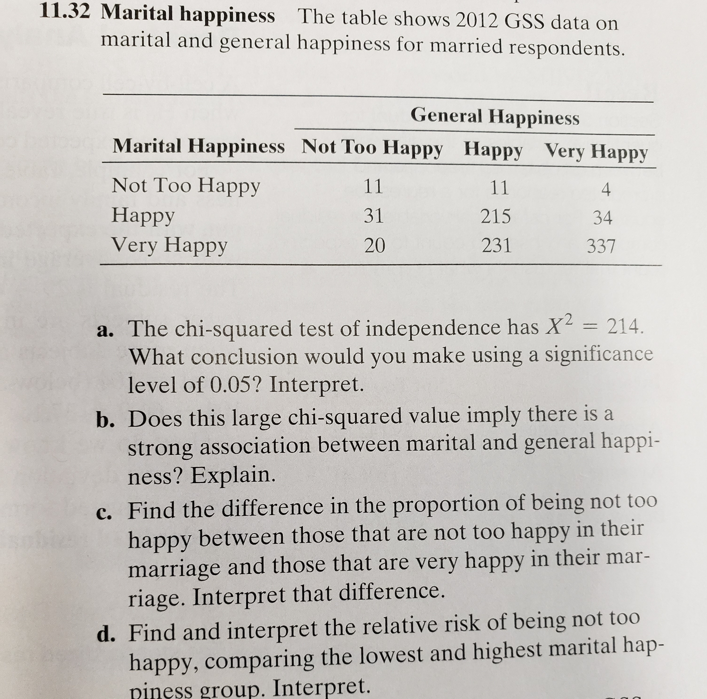

```{r setup, include=FALSE}
knitr::opts_chunk$set(echo = TRUE)
library(dplyr)
```


## Submit the solution in the form of R Markdown report, knitted into either of the available formats (HTML, pdf or Word). Provide all relevant code and output. Goal of this homework is to have you  1) familiarized with sample size calculation procedures; 2) concepts of power & Type II error for significance tests; 3) practice your R coding.


# Problem #1

  1. Write your own `my.chisq.text()` function that will perform a $X^2$-test. As a single argument, it should just take a contingency table of arbitrary size. As output, it should provide

      * Calculated $X^2$ statistic
      * p-value, 
    
  Calculating the expected cell counts under H0 hypothesis should constitute a critical part of your function definition. Don’t use neither `chisq.test()`, nor `prop.test()`, nor any other “fancy cheat” R’s built-in functions inside your function’s definition.
  
```{r}
my.chisq.test <- function(table){
  table.expected <- (rowSums(table) %o% colSums(table)) / sum(table)
  statistic <- sum( (table.expected - table)^2/table.expected )
  c(statistic = statistic,
       p.value = pchisq(statistic,
                        df = (nrow(table)-1)*(ncol(table)-1),
                        lower.tail = F)
  )
}
```
  
  2. For NYC Airbnb data set (listings.csv on Canvas), you would like to know whether there are differences
in Airbnb room types offered in different NYC burrows. Proceed to formulate this in the form of a hypothesis test, as in
```{r message=FALSE}
df <- readr::read_csv(sprintf("https://docs.google.com/uc?id=%s&export=download", "1au2tYZUtxb1AHckSTkdTthQB5OIKWJR8"))
```

  **a)** _What variables are we interested in?_\
  We are interested in the `room_type` and `neighbourhood_group` variables.
  
  **b)** _What are the hypotheses?_\
  $H_0:$Airbnb room type offering and NYC burrow are independent\
  $H_a:$Airbnb room type offering and NYC burrow are dependent
  
  **c)** _Print the contingency table. Under H0 hypothesis, proceed to calculate expected counts for two arbitrary cells of the contingency table (simply for practice)._
```{r}
temp.df <- table(df$room_type, df$neighbourhood_group)
knitr::kable(stats::addmargins(temp.df), caption = "Contingency Table")
```
  Staten Island and Shared Room: $\frac{1171\times378}{48864}\approx$ `r 1171*378/48864`\
  Manhattan and Entire home/apt: $\frac{25296\times21456}{48864}\approx$ `r 25296*21456/48864`\
  
  **d)** _Proceed to apply your my.chisq.test() and interpret the results. As a sanity check, also run R’s built-in chisq.test() function on that same data, make sure the outputted X2 and p-values match with those provided by my.chisq.test()._
```{r}
my.chisq.test(temp.df)
chisq.test(temp.df)
```
  The p-value ($\approx0$) is significantly less than the $0.05$ significance level, which leads us to reject the null hypothesis and conclude that Airbnb room offerings and NYC burrow are dependent.
  
  **e)** _In case you end up claiming that variables are not independent, proceed to make a few comments on strength of the relationship (as was done for Income & Happiness example in class)._
```{r echo=FALSE}
knitr::kable(prop.table(temp.df, margin = 1)*100, digits = 2, caption = "Conditional Percentages")
```
  - Shared room Airbnb offerings are `r round(5.81/1.49, 4)` times more likely than Entire home/apt Airbnb offerings in Bronx whereas they are only `r round(17.42/8.37, 4)` times more likely in Queens.
  - The percentage of private rooms Airbnb offerings is `r 45.23-35.70` percentage-points higher than Shared room Airbnb offerings in Brooklyn.
  
\newpage

# Problem #2

  1. **exercise $11.84$** from Agresti book.
  
```{r echo=FALSE}
opts <- options(knitr.kable.NA = "")

df.1 <- data.frame(`Political Views`=c("Extremely Liberal", "Moderate", "Extremely Conservative", "Total"), Yes=c(56,490,NA,604), No=c(NA,NA,NA,24), Total=c(58,509,61,628))
df.2 <- data.frame(`Political Views`=c("Extremely Liberal", "Moderate", "Extremely Conservative", "Total"), Yes=c(NA,NA,NA,604), No=c(NA,19,3,24), Total=c(58,509,61,628))

knitr::kable(list(df.1, df.2), caption = "Vote for Femail President", booktabs = T, valign = 't')

options(opts)  # restore global R options
```
    **a)** _Fill in the cell counts that must appear in the blank cells for the left table_
```{r echo=FALSE}
data.frame(`Political Views`=c("Extremely Liberal", "Moderate", "Extremely Conservative", "Total"), Yes=c(56,490,"(604-56-490)",604), No=c("(58-56)","(509-490)","(61-58)",24), Total=c(58,509,61,628)) %>%
  knitr::kable(caption = "Vote for Female President")
```

  **b)** _Fill in the cell counts that must appear in the blank cells for the left table_
```{r echo=FALSE}
data.frame(`Political Views`=c("Extremely Liberal", "Moderate", "Extremely Conservative", "Total"), Yes=c("(58-2)","(509-19)","(61-3)",604), No=c("(24-19-3)",19,3,24), Total=c(58,509,61,628)) %>%
  knitr::kable(caption = "Vote for Female President")
```

  2. **exercise $11.9$** from Agresti book.\
  {#id .class width=500 height=500px}
  
  **a)** $H_0:$The gender of an adult does not affect their happiness levels (Gender and Happiness are independent)\
  $H_a:$The gender of an adult affects their happiness levels (Gender and Happiness are dependent)
  
  **b)** It is plausible that gender of an adult does not affect their happiness levels (Gender and Happiness are independent)
  
  3. **exercise $11.16$** from Agresti book.\
  {#id .class width=500 height=500px}
  
  **a)** 
```{r echo=FALSE}
knitr::kable(prop.table(matrix(c(30,13,4,18,8,12,13,10), nrow = 2, dimnames = list(c("Hancock", "Trafford"), c("Fish", "Invertebrates", "Birds & Reptiles", "Others"))), margin = 1)*100, caption = "Conditional Percentages")
```
  
  **b)** $H_0:$The lake in which an alligator resides does not affect the proportion of primary foods eaten (Lake and Primary food are independent).\
  $H_a:$ The lake in which an alligator resides affects the proportion of primary foods eaten (Lake and Primary food are dependent)
  
  **c)** The $X^2$ value can be considered large because the chi-squared distribution with $3$ degrees of freedom has an equivalent mean ($\mu=3$) and is heavily right skewed. A value of $16.79$ is more than five times the mean.
  
  **d)** A p-value less than $0.001$ indicates that the primary foods an alligator eats is dependent on the lake in which they live.
  

# Problem #3

  1. For all three examples on the “X2 Does NOT Measure Strength of Association” slide, proceed to
  **a)** _Use the my.chisq.test() function you’ve defined previously in order to confirm the X2 and p-values. Hint: Make sure to convert the %’es into counts first._
```{r}
df <- matrix(c(.51,.49,.49,.51), nrow = 2)
data.frame(A=my.chisq.test(df*100), B=my.chisq.test(df*200), C=my.chisq.test(df*10000)) %>%
  knitr::kable(digits = 3)
```
  **b)** _Calculate the difference in proportion between males & females that attend religious services weekly. Calculate the risk ratio between males & females that attend religious services weekly._\
Proportion Difference$:0.51-0.49=$ `r .51-.49`\
Risk Ratio$:\frac{0.51}{0.49}\approx$ `r round(.51/.49,2)`
  
  
  **c)** _Based on your answers to parts (a)-(b), as n increases, what do you notice with respect to statistical significance? Practical significance?_\
  As the sample size increases, the statistical significance increases.
  Both the proportion difference and the risk ratio indicate a weak practical significance since the resulting value is closer to 0 and close to 1, respectively.


  2. **exercise $11.32$** from Agresti book.\
  {#id .class width=500 height=500px}

  **a)** The p-value ($\approx$ `r round(pchisq(214, 4, lower.tail=F), 4)`) indicates that general happiness of an adult is dependent on their marital happiness.
  
  **b)** $X^2$ value cannot be used to determine the practical strength of an association.
  
  **c)** 
```{r include=FALSE}
p.1 <- round(11/(11+11+4), 4)
p.2 <- round(20/(20+231+337), 4)
```
  $p_{not~happy, not~happy}\approx$ `r p.1`\
  $p_{very~happy, not~happy}\approx$ `r p.2`\
  Adults who are not happy in their marriage are `r (p.1-p.2)*100` percentage points more likely to be unhappy in general than adults who are very happy in their marriage.
  
  
  **d)** \
  $p_{not~happy, not~happy}\approx$ `r p.1`\
  $p_{very~happy, not~happy}\approx$ `r p.2`\
  Adults who are not happy in their marriage are `r p.1/p.2` times more likely to be unhappy in general than adults who are very happy in their marriage.